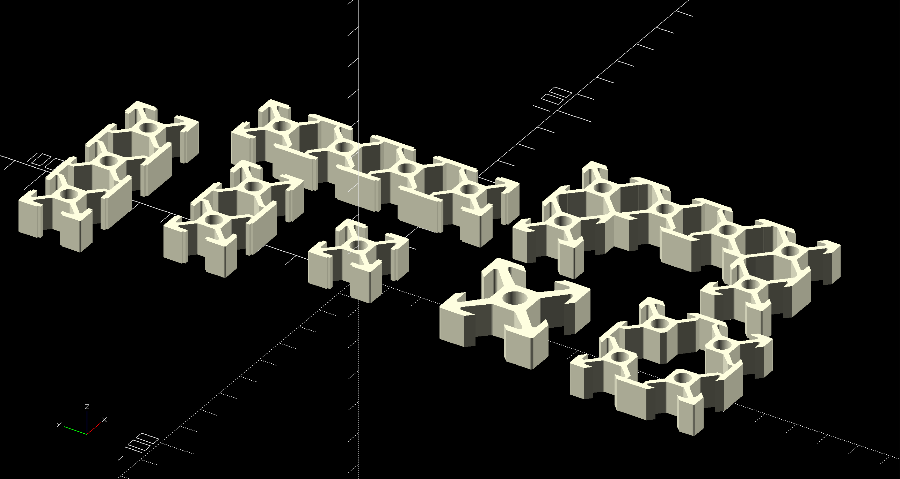

# OpenSCAD Aluminum Extrusion Profile Library

This is a library you can use to generate Aluminum Extrusion Profiles to 3D print. The library has a number of available modules for various profiles that are drawn as a 2D object. From there, you can use `linear_extrude()` to extrude any length of the aluminum you desire.



Example:

```
$fn = 100;

include <AluminumExtrusionProfile.scad>

// 10 cm of 2020 Aluminum Extrusion
linear_extrude(10) 2020_extrusion_profile(slot = "t");
```

[Additional Examples](./examples.scad)

## Available Profile Modules (will add more in future)
- 2020
- 2040
- 2060
- 2080
- 4080
- 4040
- 3030

# License
Copyright 2023 Jen Reed

Licensed under the Apache License, Version 2.0 (the "License");
you may not use this work except in compliance with the License.
You may obtain a copy of the License at

    http://www.apache.org/licenses/LICENSE-2.0

Unless required by applicable law or agreed to in writing, software
distributed under the License is distributed on an "AS IS" BASIS,
WITHOUT WARRANTIES OR CONDITIONS OF ANY KIND, either express or implied.
See the License for the specific language governing permissions and
limitations under the License.
"README.md" 156L, 5342B
